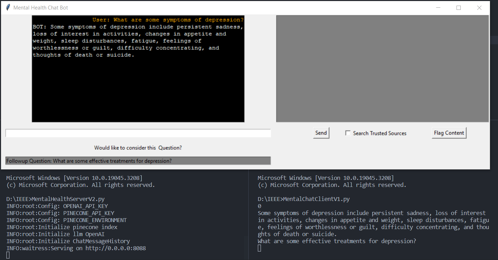

# SmartMentor - Mental Health-Oriented Chatbot with ChatGPT API
Description:
This repository contains the codebase and resources for a mental health-oriented chatbot developed using the ChatGPT API. The chatbot aims to provide support, information, and resources related to mental health queries. The project focuses on efficient communication, security, and accuracy.

Features:

Utilizes the ChatGPT API for the basic chatbot framework.
Implements encryption and security measures through a secure vault mechanism to protect API keys. (for now, they are stored in Config.json)

Adopts a prompt-based engineering method for quicker training and response time.

Customized prompts guide the chatbot's interactions, a technique known as shot prompting.

Refines prompts using the Langchain library, incorporating pre-trained language models.

Optimized indexing and searching algorithms ensure faster and more accurate replies.

Incorporates Pinecone Vector database for accurate data storage and retrieval.

Performs precise Cosine similarity searches between user queries and stored documents.

Uses OpenAI models: text-embedding-ada-002 for text-to-vector conversion, GPT Turbo 3.5 for natural conversations.

Enhances comprehension of user sentiment and adjusts responses accordingly.

Ensures moderation and filters out hateful speech for a positive user experience.

Getting Started:
To set up the project locally, follow these steps:

Clone the repository: git clone https://github.com/friedcheesee/IEEEsmartmentor.git
Configure your API keys and tokens in the designated configuration files.
Run the chatbot application: MentalHealthServerV2.py, and then MentalChatClient1.py
Interact with the chatbot through the provided interface.
